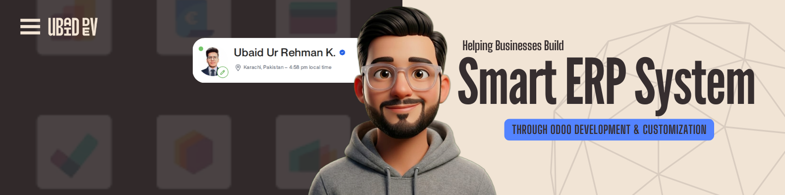

# Hi 👋, I'm Ubaid Ur Rehman

<h3 align="center">
Python & Odoo ERP Developer | ERP Customization | Business Automation
</h3>

  

---

# 💼 About Me

I'm a **Python & Odoo ERP Developer** passionate about building scalable ERP solutions and business automation systems.

I specialize in **custom Odoo module development**, **Python backend development**, and **ERP workflow customization**. My goal is to create clean, maintainable, and high-performance solutions that help businesses automate and optimize their daily operations.

---

# 🚀 What I Do

- 🔹 Custom Odoo Module Development
- 🔹 ERP Customization & Automation
- 🔹 Python (Odoo ORM)
- 🔹 XML Views & QWeb Reports
- 🔹 REST API Integration
- 🔹 PostgreSQL Database Design
- 🔹 Business Workflow Development
- 🔹 Security Rules & Access Rights
- 🔹 Bug Fixing & Performance Optimization

---

# 🛠️ Tech Stack

---

# 📌 Odoo Expertise

- Odoo 13 – Odoo 18
- Custom Module Development
- Python ORM
- All XML Views
- QWeb Reports & Excel Reports
- Sales
- Purchase
- Accounting
- Inventory
- CRM
- Human Resources
- Healthcare Management System (HMS)
- Approval Workflows
- KYC Systems
- Multi-company Configuration

---

# 💻 Technical Skills

| Category | Skills |
|-----------|--------|
| **Backend** | Python, Odoo ORM |
| **Database** | PostgreSQL, MySQL |
| **Frontend** | HTML5, CSS3, JavaScript |
| **Frameworks** | Bootstrap, Tailwind CSS , Owl Framework |
| **Version Control** | Git, GitHub |
| **Tools** | VS Code, PyCharm |

---

# 📈 GitHub Statistics

---

# 🌱 Currently Learning

- Advanced Odoo 19 Development
- Docker
- REST API Best Practices
- CI/CD
- Enterprise ERP Architecture

---

# 🤝 Open To

- ✅ Freelance Projects
- ✅ Remote Opportunities
- ✅ Odoo ERP Development
- ✅ Business Automation
- ✅ ERP Consultation
- ✅ Long-term Collaboration

---

# 📫 Connect With Me

  

  
  
  
  

---

### ⭐ Thanks for visiting my profile!

If you like my work, consider **following** me and **starring** my repositories.

